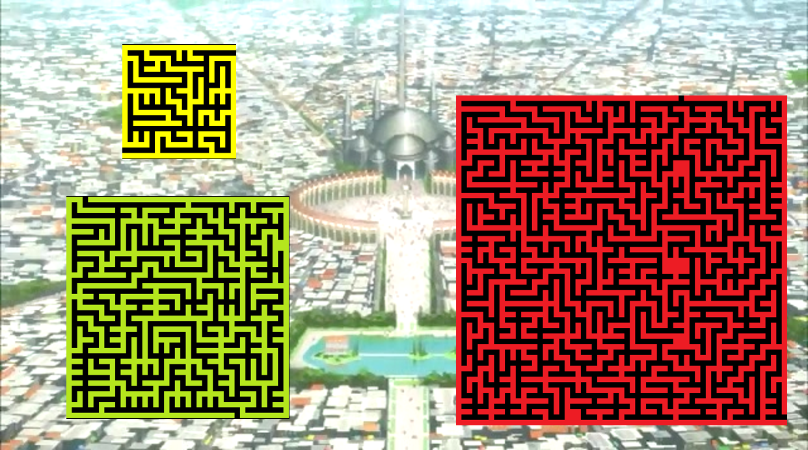

# 黑鐵宮

**組合語言期末專題報告**

組員：李○○ 彭○○ 梁○○ 劉○○

# 動機

上過控制游標與畫地圖的課程後，就想到可以畫一張地圖，用游標當作控制的角色。剛開始有想過幾個有些類似的遊戲，像是倉庫番(推箱子)、小黑屋(英文是a dark room)的地圖冒險遊戲，不過最後因為時間緊迫，就做出比較簡單的走迷宮。可是單純的走迷宮又太單調。所以我們聯想到許多地圖遊戲都有視野的概念，最後做出類似洞穴探險的迷宮小遊戲。

# 程式構想

基本上就是用方向鍵走迷宮的小遊戲。程式中包括不能走入迷宮牆壁內的判斷、變換不同大小的迷宮。不過在我們加入視野的元素之後，相當於改變迷宮的樣貌。因此我們就有兩種地圖，一個是全部都是╥，也就是還沒看過的地圖，另一個是真正的迷宮。直到游標走到的時候才會看到附近的視野。走過的視野也會保留，否則這遊戲就太難了。

# 程式說明

1. 請在cmd中的內容\>選項\>勾選使用舊版主控台，並且輸入chcp 437，以免發生顯示錯誤。

2. 程式中有一個bug到現在都找不到原因…假如到地圖最上一列再往上走，游標會卡在那邊。大約等過個十幾秒以後又可以動了，所以我覺得應該是延遲吧？我也沒辦法在程式碼中找出錯誤QQ假如在試用程式的過程中請留意不要在最上一列再按上了，要等很久。

    // 註解是程式碼說明！以下為簡化版程式碼。有許多重複部分將省略。    

    INCLUDE Irvine32.inc    

    main    EQU start@0    

    MazeWidth =21 // 第一個地圖大小    

    MazeHeight =21    

    MazeWidth2=41 // 第二個地圖大小    

    MazeHeight2 =41    

    MazeWidth3=61 // 第三個地圖大小    

    MazeHeight3 =61    

    .data    

        

    consoleHandle    DWORD ?    

    xyPos COORD <0,19> ; // 第一個地圖起始座標    

        

    outputHandle DWORD 0    

    bytesWritten DWORD 0    

    count DWORD 0    

    mapPosition COORD <0,0>    

    cellsWritten DWORD ?    

    color word 61 dup(0eh)    

    color2 word 61 dup(0Ah)    

    color3 word 61 dup(0bh)    

        

    // 下方三行為空白的迷宮，要走過才會留下痕跡(視野)    

    MazeBlank  BYTE MazeWidth*MazeHeight DUP(210)    

    MazeBlank2  BYTE MazeWidth2*MazeHeight2 DUP(210)    

    MazeBlank3  BYTE MazeWidth3*MazeHeight3 DUP(210)    

    MazeClear  BYTE (210)    

        

    // Maze,Maze2,Maze3 各為不同地圖，下方程式碼在報告書中省略    

    Maze // ~~~~省略~~~~    

    Maze2 // ~~~~省略~~~~    

    Maze3 // ~~~~省略~~~~    

        

    .code    

    main PROC    

        ; Get the Console standard output handle:    

        INVOKE GetStdHandle, STD_OUTPUT_HANDLE    

        mov consoleHandle,eax    

        INVOKE GetStdHandle, STD_OUTPUT_HANDLE ; Get the console ouput handle    

        mov outputHandle, eax ; save console handle    

    // 這裡畫第一張地圖    

    DRAW:    

        mov mapPosition.x,0    

        mov mapPosition.y,0    

        call Clrscr    

        

        mov ecx,MazeHeight ; number of lines in body    

        // 因為地圖資料是連續的，所以每過(地圖寬度)個位元就會換一列。    

        mov edi,offset MazeBlank    

    L1: push ecx  ;    

        INVOKE WriteConsoleOutputAttribute,    

          outputHandle,    

          addr color,    

          MazeWidth,    

          mapPosition,    

          ADDR count    

        INVOKE WriteConsoleOutputCharacter,    

           outputHandle,   ; console output handle    

           edi,   ; pointer to the top Maze line    

           MazeWidth,   ; size of Maze line    

           mapPosition,   ; coordinates of first char    

           ADDR bytesWritten    ; output count    

        inc mapPosition.y   ; next line    

        add edi,MazeWidth    

        pop ecx   ; restore counter    

    loop L1    

    // 這裡開始移動游標，在移動的同時也判斷在迷宮的位置，以方便改變迷宮樣貌(有視野)    

    START:    

        INVOKE SetConsoleCursorPosition, consoleHandle , xyPos    

        call ReadChar    

    UP:    

        cmp ax,4800h ;UP    

            jne DOWN    

            sub xyPos.y,1    

            mov esi,offset Maze    

            mov ax,xyPos.y    

            movzx ecx,ax    

    UPDOWN1:    

            add esi,MazeWidth    

    loop UPDOWN1    

            mov ax,xyPos.x    

            add si,ax    

            mov al,[esi]    

            cmp al,219 // 如果撞牆就會把座標回到原本的位置。    

            jne Blind    

            add xyPos.y,1    

            jmp Blind    

    // ~~~~上下左右基本上一樣，省略下、右、左的部分~~~~    

        

    // 按esc就會結束。    

    BYE:    

        cmp ax,011Bh ;ESC    

            je END_FUNC    

    // 下方就是改變地圖的做法。基本上就是把游標座標附近的空白迷宮改成真正的迷宮。上方就是位址-迷宮寬度。左下方就是位址+迷宮寬度-1。以此類推。    

    Blind:    

        movzx eax , xyPos.x    

        movzx ecx , xyPos.y    

        mov esi , OFFSET MazeBlank    

        mov edi , OFFSET Maze    

        ADD esi , eax    

        ADD edi , eax    

    MU:    

        ADD esi , MazeWidth    

        ADD edi , MazeWidth    

    loop MU    

        mov al , [edi] ; // 中間    

        mov [esi] , al    

        

        mov al , [edi+1]; // 右邊    

        mov [esi+1] , al    

    // ~~~~其他九宮格位置就不再寫出~~~~    

    PrintA:    

    // ~~~~印出新的迷宮，與前面一樣，因此省略~~~~    

    loop PrintA    

        

        cmp xyPos.x,20 // 判斷是否到達終點    

        jne START    

        cmp xyPos.y,1    

        jne START    

        call Clrscr    

    // 以下就是開始走第二個迷宮    

        // 各種初始化    

        mov bytesWritten , 0    

        mov count , 0    

        mov cellsWritten , 0    

        

        mov ecx,MazeHeight*MazeWidth    

        mov esi, OFFSET MazeBlank    

        mov edi, OFFSET MazeClear    

        mov al, [edi]    

    // 原本不做CLEAN這個動作的話，第二個迷宮似乎會和第一個迷宮重疊到，因此產生錯誤。所以才把第一個迷宮大小的資料全部初始化成╥。    

    CLEAN:    

        mov[esi],al    

        inc esi    

    LOOP CLEAN    

    // 以下和第一個迷宮的不同，只剩下長度跟寬度的不同(還有顏色)，因此全部省略。    

    DRAWQ:    

    // 第三次也與第二次類似。只有迷宮長寬的不同。初始化一些東西就完成了。    

    END_FUNC:    

        call WaitMsg    

        exit    

    main ENDP    

    END main

# 分工

梁○○:不會撞牆，標題

李○○:遮蔽地圖

劉○○:迷宮地圖

彭○○:做ppt

## 心得

　　從無到有不一定是最難跨越的挑戰，但是當一開始修組與這堂課，聽到期末要做遊戲時，不免會覺得有些害怕，因為剛開始所教的東西：數值在暫存器和記憶體之間跑來跑去，很難使我聯想到最後可以做出一個遊戲出來；當然教到最後，其實心裡已經大概有底了，但這學期的課程一路走來到今天這一步，想想還是蠻不可思議的。我們最後聯手做出了一個迷宮出來，這也是另一個不可思議的地方，我第一次和別人分工合作，完成了一個不小的程式，而且所有程式都是我們憑空打出來的，完成度也不低，這對我而言真的是一次難忘的經歷。
